# quaqcr: *QU*ick *A*TAC-seq *Q*uality *C*ontrol in *R*

quaqcr is an accessory R package for [quaqc](https://github.com/bjmt/quaqc).

## Installation

```R
if (!requireNamespace("remotes")) install.packages("remotes")
remotes::install_github("bjmt/quaqcr")
```

Installation of the quaqcr package has been tested on macOS (R v4.4.1), Windows (R v4.4.1 and v4.0.5), and Ubuntu linux (all minor R versions from v4.4.1 back to R v3.6.3). The package is very lightweight and only has one dependency, [jsonlite](https://CRAN.R-project.org/package=jsonlite). Please open an issue if you are having trouble installing the package.

See the [quaqc](https://github.com/bjmt/quaqc) repository
for installation instructions for quaqc. The quaqcr package does not
required quaqc to be installed to parse the output JSON
reports, though it can be used to execute quaqc from within R.

## Quick start

Run quaqc from within R:

```R
report <- quaqc("Sample.bam", peaks = "Peaks.bed", tss = "TSS.bed",
  blacklist = "Blacklist.bed")
```

Load a previous run into R:

```R
report <- parse_quaqc_file("report.json.gz")
```

Explore the various datasets available within quaqc reports,
ready for plotting with ggplot2:

```R
melt_reports(report, "genome")
melt_reports(report, "overview_unfilt")
melt_reports(report, "overview_filt")
melt_reports(report, "nucl_stats")
melt_reports(report, "nucl_addn")
melt_reports(report, "peak_stats")
melt_reports(report, "frag_hist", normalize.hist = "proportion")
melt_reports(report, "depth_hist", normalize.hist = "proportion")
melt_reports(report, "gc_hist", normalize.hist = "proportion")
melt_reports(report, "tss_pileup", normalize.tss = "bkg")
```

## Tutorial

### Download the example data

To follow along with this tutorial, download the example data
from Zenodo using the following command:

```sh
wget -O SRR26098097.Chr4MtPt.bam "https://zenodo.org/records/11653279/files/SRR26098097.Chr4MtPt.bam?download=1"
```

This downloads a partial BAM for the SRA accession SRR26098097,
an _Arabidopsis thaliana_ ATAC-seq sample (Seller et al PNAS 2023).
The reads were trimmed with `fastp`, mapped to the TAIR10 genome
assembly with `bowtie2`, sorted and duplicates marked with `samtools`.
Then, the BAM was reduced to only keep all reads aligned to
chromosome 4 and the mitochondria, as well as 10% of the reads
aligned to the chloroplast. The resulting file is approximately 355 MB.

### Generate an initial quaqc report from within R

Let's start by launching R and loading the quaqcr and ggplot2 packages,
then creating links to the various files we will need:

```R
library(quaqcr)
library(ggplot2)

blacklist <- system.file("extdata", "bl.bed.gz", package = "quaqcr")
peaks <- system.file("extdata", "peaks.bed.gz", package = "quaqcr")
tss <- system.file("extdata", "tss.bed.gz", package = "quaqcr")
bam <- "SRR26098097.Chr4MtPt.bam"
```

We will also set the `quaqc.bin` option globally to tell quaqcr where
it can find the quaqc binary. By default, it is assumed to be in the
user's `PATH`. It can also be set within each function.

```R
options(quaqc.bin = "~/quaqc/quaqc")
```

Finally, to prevent large numbers from being printed in scientific notation:

```R
options(scipen = 8)
```

We can now try running quaqc on our example BAM from within R. Since this
BAM has been subset to only one chromosome, it is important to tell quaqc
this too so it is taken into account when computing quality metrics.

```R
report <- quaqc(bam, peaks = peaks, tss = tss, blacklist = blacklist,
  target.names = c("4", "Mt", "Pt"), tss.tn5 = TRUE)
#> quaqc -v --json - --target-names 4,Mt,Pt --no-output --tss-tn5 --blacklist /Users/ben/quaqcr/inst/extdata/bl.bed.gz --tss /Users/ben/quaqcr/inst/extdata/tss.bed.gz --peaks /Users/ben/quaqcr/inst/extdata/peaks.bed.gz SRR26098097.Chr4MtPt.bam
#> Warning: Removed 600 overlapping ranges in --tss.
#> Starting file: SRR26098097.Chr4MtPt.bam [thread#1]
#> Finished file: SRR26098097.Chr4MtPt.bam
#> |--> Processed 9.8 M reads, 46.6% passing filters.
#> |--> Time to process: 5 seconds.
#> 
#> Done. Processed 1 sample (1 successfully) in 5 seconds.
#>  All QC results saved in JSON output: /dev/stdout
#>  memory usage: 3.50 MB
```

This `quaqc()` function is merely a wrapper around the program of the same
name. All options are available to be changed; see `?quaqc` for a list.
The brief description of the options can also be displayed by simply
running `quaqc()` without any arguments from within R. The only non-default
options are those regarding the output report: creation of the regular
text report is suppressed and the JSON report is output directly to
within R. Of course, this can all be adjusted.

### Exposing quaqc statistics

Now that we have our report, we can examine the output object and its
structure.

```R
report
#> quaqc v1.1
#> Run title: ---
#> Run date: 2024-06-13 13:57:38 CEST
#> Number of samples: 1
#> Number of fails:   0
#> Reports:
#>     [SUCCESS] SRR26098097.Chr4MtPt.bam
#> To examine run data: $metadata
#> To examine reports:  $reports
#> See ?parse_quaqc for ways to access QC data.
```

As we can see, this prints some basic information about the run,
including the number of samples and how many of them ran without error.
We can view the metadata available for the run:

```R
report$metadata
#> $version
#> [1] "1.1"
#> 
#> $title
#> [1] ""
#> 
#> $date
#> [1] "2024-06-13 13:57:38 CEST"
#> 
#> $args
#> [1] "-v --json - --target-names 4,Mt,Pt --no-output --tss-tn5 --blacklist /Users/ben/quaqcr/inst/extdata/bl.bed.gz --tss /Users/ben/quaqcr/inst/extdata/tss.bed.gz --peaks /Users/ben/quaqcr/inst/extdata/peaks.bed.gz "
#> 
#> $samples
#> [1] 1
#> 
```

And of course, the actual reports:

```R
report$reports
#> [[1]]
#> Sample: SRR26098097.Chr4MtPt.bam
#> Status: success
#> Processed 1 sequences (18293156 bp).
#> Reads: 9846473 total; 3867479 passing.
#> GC histo: yes. Depths histo: yes.
#> Peak stats: yes. TSS pileup: yes.
#> Available slots:
#> $sample      -- Sample filename
#> $success     -- Run status
#> $params      -- Run parameters
#> $genome      -- Genome stats
#> $unfiltered  -- Pre-filter read stats
#> $filtered    -- Post-filter read stats
#> 
```

The output of this is a list of reports, one per sample. In this case
only sample was used, so it is a list of length 1. These reports are
themselves simply lists, containing several slots as shown above. All
slots can be accessed normally using the `$` method, or by using the
`melt_reports()` convenience function that 'melts' the objects down to
an easily manipulated `data.frame`. In this tutorial we will use
the latter method. First, basic information about the genome associated
with the BAM:

```R
melt_reports(report, "genome")
#>                     Sample      Sequence Count      Size
#> 1 SRR26098097.Chr4MtPt.bam         total     7 119667750
#> 2 SRR26098097.Chr4MtPt.bam       nuclear     5 119146348
#> 3 SRR26098097.Chr4MtPt.bam mitochondrial     1    366924
#> 4 SRR26098097.Chr4MtPt.bam     plastidic     1    154478
#> 5 SRR26098097.Chr4MtPt.bam     effective     1  18293156
```

Some stats about all reads before any filtering parameters are applied:

```R
melt_reports(report, "overview_unfilt")
#>                     Sample             Reads Nuclear Mitochondrial Plastidic
#> 1 SRR26098097.Chr4MtPt.bam             Total 5797181       1086755   2950676
#> 2 SRR26098097.Chr4MtPt.bam        Duplicated 1350466        338549   2200811
#> 3 SRR26098097.Chr4MtPt.bam                SE       0             0         0
#> 4 SRR26098097.Chr4MtPt.bam                PE 5797181       1086755   2950676
#> 5 SRR26098097.Chr4MtPt.bam        ProperMate 5788014       1085446   2947024
#> 6 SRR26098097.Chr4MtPt.bam           Primary 5797181       1086755   2950676
#> 7 SRR26098097.Chr4MtPt.bam PrimaryDuplicated 1350466        338549   2200811
#> 8 SRR26098097.Chr4MtPt.bam         Secondary       0             0         0
#> 9 SRR26098097.Chr4MtPt.bam     Supplementary       0             0         0
```

And finally, overview stats about the final reads after filtering:

```R
melt_reports(report, "overview_filt")
#>                     Sample           Reads    Nuclear Mitochondrial Plastidic
#> 1 SRR26098097.Chr4MtPt.bam  AlnPassFilters 3867479.00     296438.00 416192.00
#> 2 SRR26098097.Chr4MtPt.bam      AlnSizeAvg      92.36         87.63    105.03
#> 3 SRR26098097.Chr4MtPt.bam    ReadDepthAvg      19.53         70.80    282.97
#> 4 SRR26098097.Chr4MtPt.bam FragPassFilters 1933741.00     148219.00 208096.00
#> 5 SRR26098097.Chr4MtPt.bam     FragSizeAvg     129.67        113.33    148.24
#> 6 SRR26098097.Chr4MtPt.bam         MAPQAvg      41.38         41.23     41.32
#> 7 SRR26098097.Chr4MtPt.bam        GCPctAvg      37.14         46.22     34.64
```

There is quite a bit of data beyond this associated with the final
nuclear-aligned reads.

```R
melt_reports(report, "nucl_stats")
#>                     Sample      Reads AlignmentSize FragmentSize   MAPQ
#> 1 SRR26098097.Chr4MtPt.bam        Min         18.00         18.0 30.000
#> 2 SRR26098097.Chr4MtPt.bam  1stPctile         37.00         38.0 30.000
#> 3 SRR26098097.Chr4MtPt.bam    Average         92.36        129.7 41.380
#> 4 SRR26098097.Chr4MtPt.bam         SD         43.14        133.9  2.293
#> 5 SRR26098097.Chr4MtPt.bam 99thPctile        150.00        996.0 42.000
#> 6 SRR26098097.Chr4MtPt.bam        Max        150.00       1845.0 42.000
#>   ReadDepth GCPercent
#> 1      0.00     3.000
#> 2      5.00    21.000
#> 3     19.53    37.143
#> 4     24.56     8.709
#> 5    305.00    61.000
#> 6    685.00    87.000
```
```R
melt_reports(report, "nucl_addn")
#>                     Sample GenomeCoverage AlnNoMAPQ
#> 1 SRR26098097.Chr4MtPt.bam         0.9818         0
```
```R
melt_reports(report, "peak_stats")
#>                     Sample PeakCount PeakGenomeCov    FRIP
#> 1 SRR26098097.Chr4MtPt.bam      4557         0.127 0.01357
```
(Note that for illustrative purposes, I am using a partial peak set from
a previous project where I performed ATAC-seq during germination;
thus most of the peaks in this particular mesophyll sample are different,
leading to the very low FRIP score.)
```R
melt_reports(report, "tss_stats")
#>                     Sample TSSCount   TES
#> 1 SRR26098097.Chr4MtPt.bam     3026 2.627
```

All of the above data are the same set of statistics included in the basic
text report when running quaqc from the command line, simply accessible
from R. Additionally, when multiple samples are used in a single run
their statistics are merged together into a single `data.frame` by
the `melt_reports()` function for easier between-sample comparisons.
See the help page for more info: `?melt_reports`

### Fragment, GC and read depth histograms

During data collection, quaqc internally constructs complete histograms
of alignment and fragment lengths, alignment GC percent, and read depths.
Only summary statistics are printed in the regulat text report, though
for those wishing to see the raw data they can be output in their
complete form by allowing the report to be output in JSON format. Since
the `quaqc()` function by default runs quaqc in such a way that it
outputs a JSON report, we can easily access such data without setting
any extra options.

An especially important metric in ATAC-seq quality control is the fragment
length distribution. Since we expect most transposition events to occur
within nucleosome-free regions, the highest density of fragment sizes should
be below ~147 bp, the approximate length of DNA wrapped around a nucleosome.
Since the default list format containing this data is a bit inconvenient
for plotting, we will use `melt_reports()` to get it into a format ready for
plotting with `ggplot2`:

```R
frag.hist <- melt_reports(report, "frag_hist", normalize.hist = "max")
ggplot(frag.hist, aes(FragSize, Count)) +
  scale_x_continuous(limits = c(0, 1000)) +
  ylab("Density") +
  xlab("Fragment size") +
  geom_line() +
  theme_bw()
```
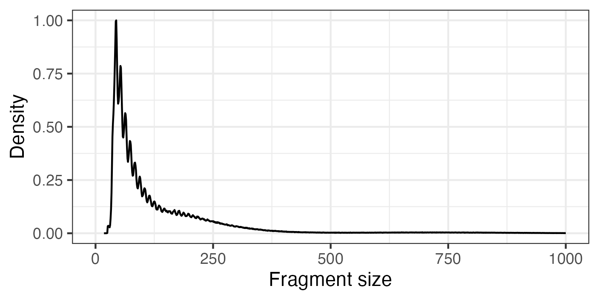

Now we can see the clear nucleosome-free peak below ~125 bp in the plot.
There is a bit of a hump around 150-200 bp, perhaps indicative of 
mononucleosomal fragments, though in case it is not very distinct; 
in my experience this can be very variable between samples. 

To see the effect that the presence of nucleosomes has on transposition,
we can compare with the distribution from chloroplastic reads. To do this,
we can first re-run quaqc and tell it to only gather data from the
chloroplast and treat it as a "nuclear" sequence:

```R
report.pt <- quaqc(bam, target.names = "Pt", plastids = " ", verbose = 0)
#> quaqc --json - --target-names Pt --plastids   --no-output SRR26098097.Chr4MtPt.bam
frag.hist.pt <- melt_reports(report.pt, "frag_hist", normalize.hist = "max")
frag.hist$Sample <- "Nuclear"
frag.hist.pt$Sample <- "Chloroplastic"
frag.hist <- rbind(frag.hist, frag.hist.pt)
ggplot(frag.hist, aes(FragSize, Count, colour = Sample)) +
  scale_x_continuous(limits = c(0, 1000)) +
  ylab("Density") +
  xlab("Fragment size") +
  scale_colour_discrete(name = element_blank()) +
  geom_line() +
  theme_bw()
```
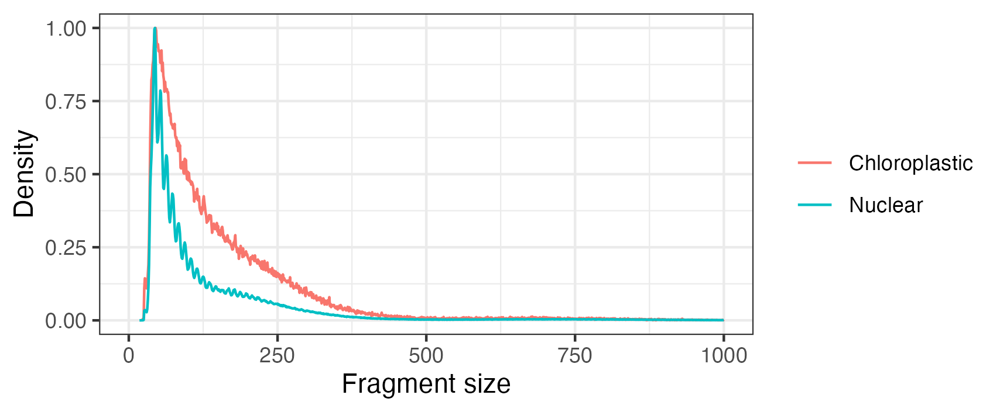

Now we can see that there is no clear distinct sub-nucleosomal peak in
naked DNA.

Next, we can take a look at the GC histograms. Since we have the report
from the chloroplast, we can compare with that too:

```R
gc.hist <- melt_reports(report, "gc_hist", normalize.hist = "max")
gc.hist.pt <- melt_reports(report.pt, "gc_hist", normalize.hist = "max")
gc.hist$Sample <- "Nuclear"
gc.hist.pt$Sample <- "Chloroplastic"
gc.hist <- rbind(gc.hist, gc.hist.pt)
ggplot(gc.hist, aes(GCPercent, Count, colour = Sample)) +
  scale_x_continuous(limits = c(0, 100)) +
  scale_colour_discrete(name = element_blank()) +
  ylab("Density") +
  geom_line() +
  theme_bw()
```
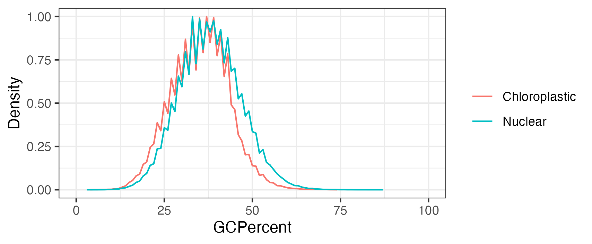

From this we can see the chloroplast reads are slightly more AT rich,
and we get a nice distribution from the nuclear reads without any
spikes or additional peaks.

Finally, we can look at the read depths:

```R
depth.hist <- melt_reports(report, "depth_hist", normalize.hist = "max")
depth.hist.pt <- melt_reports(report.pt, "depth_hist", normalize.hist = "max")
depth.hist$Sample <- "Nuclear"
depth.hist.pt$Sample <- "Chloroplastic"
depth.hist <- rbind(depth.hist, depth.hist.pt)
ggplot(depth.hist, aes(ReadDepth, Count, colour = Sample)) +
  ylab("Density") +
  scale_colour_discrete(name = element_blank()) +
  geom_line() +
  theme_bw()
```
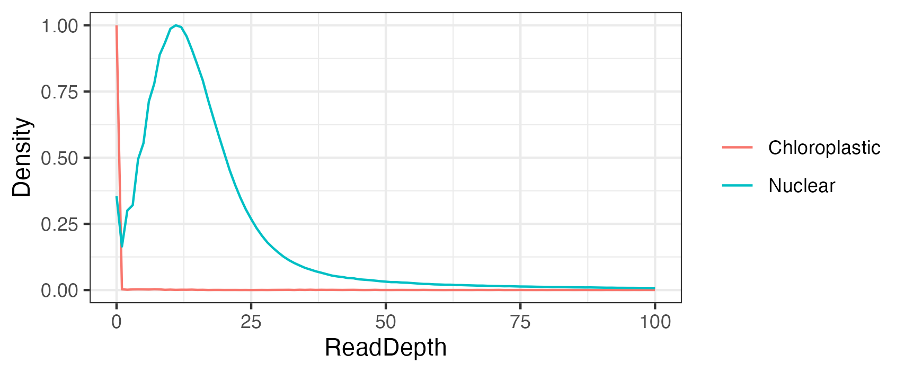

The nuclear read depth peaks around 12, with a long tail to the right.
There is a small spike at 0, which could be from repetitive regions
lacking high scoring reads. On the other hand, there doesn't seem to
be an obvious peak for the chloroplast. We can reveal a bit about what
could be happening by replotting the data with a higher x-axis limit
and log-transforming the y-axis:

```R
ggplot(depth.hist, aes(ReadDepth, Count, colour = Sample)) +
  ylab("Density") +
  scale_colour_discrete(name = element_blank()) +
  scale_y_log10() +
  geom_line() +
  theme_bw()
```
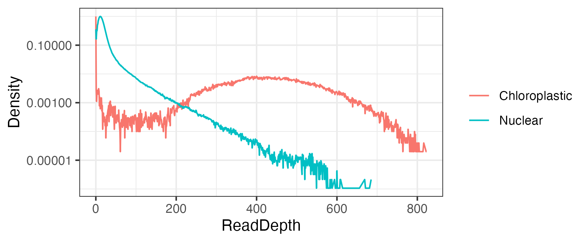

Now we can see just how high the read depth of the chloroplast
is! (In reality it is about ten times this, since this BAM has
been subsampled to 10% of the chloroplast-aligned reads.)

### Transcription start site enrichment

By far one of the most useful quality control metrics for ATAC-seq
data is TSS enrichment, since promoters tend to be quite accessible
and comparing their average accessibility with background levels
can be a good way to gage the signal-to-noise ratio of the experiment.

Let's take a look at the precomputed TSS enrichment score (TES) again,
using `melt_reports()` once more for simplicity:

```R
melt_reports(report, "tss_stats")
#>                     Sample TSSCount   TES
#> 1 SRR26098097.Chr4MtPt.bam     3026 2.627
```

This score is calculated by dividing the max read depth in the middle
10% window (where the TSS will be) by the average read depth in the
starting 25% window (representing the background). The actual raw
pileup is stored in the JSON report, and we can extract it
with `melt_reports()` as before, though this time there is an additional
option we can activate to transform the read depths into relative
read depth:

```R
tss.pileup <- melt_reports(report, "tss_pileup", normalize.tss = "bkg")
ggplot(tss.pileup, aes(Coordinate, Depth)) +
  geom_line() +
  ylab("Density") +
  theme_bw()
```
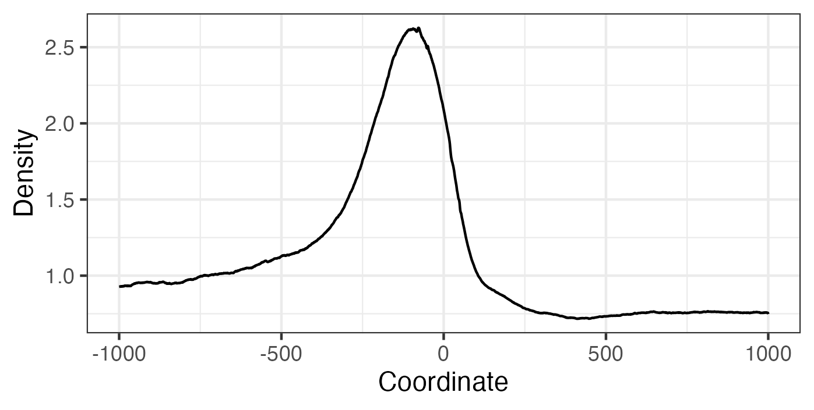

This is also a great way to compare the effects of read filtering
parameters. For example, we can see what happens if we simply
don't filter out any nuclear reads versus applying some stricter
filters (via `--strict`):

```R
report.filt <- quaqc(bam, peaks = peaks, tss = tss, blacklist = blacklist,
  target.names = c("4", "Mt", "Pt"), tss.tn5 = TRUE, strict = TRUE, v = 0)
#> quaqc --json - --target-names 4,Mt,Pt --no-output --strict --tss-tn5 --blacklist /Users/ben/quaqcr/inst/extdata/bl.bed.gz --tss /Users/ben/quaqcr/inst/extdata/tss.bed.gz --peaks /Users/ben/quaqcr/inst/extdata/peaks.bed.gz SRR26098097.Chr4MtPt.bam
report.all <- quaqc(bam, peaks = peaks, tss = tss, blacklist = blacklist,
  target.names = c("4", "Mt", "Pt"), tss.tn5 = TRUE, use.all = TRUE, v = 0)
#> quaqc --json - --target-names 4,Mt,Pt --no-output --tss-tn5 --use-all --blacklist /Users/ben/quaqcr/inst/extdata/bl.bed.gz --tss /Users/ben/quaqcr/inst/extdata/tss.bed.gz --peaks /Users/ben/quaqcr/inst/extdata/peaks.bed.gz SRR26098097.Chr4MtPt.bam
tss.pileup.filt <- melt_reports(report.filt, "tss_pileup", normalize.tss = "bkg")
tss.pileup.all <- melt_reports(report.all, "tss_pileup", normalize.tss = "bkg")
tss.pileup.filt$Sample <- "Filtered"
tss.pileup.all$Sample <- "All"
tss.pileup.filt <- rbind(tss.pileup.filt, tss.pileup.all)
ggplot(tss.pileup.filt, aes(Coordinate, Depth, colour = Sample)) +
  geom_line() +
  ylab("Density") +
  theme_bw()
```
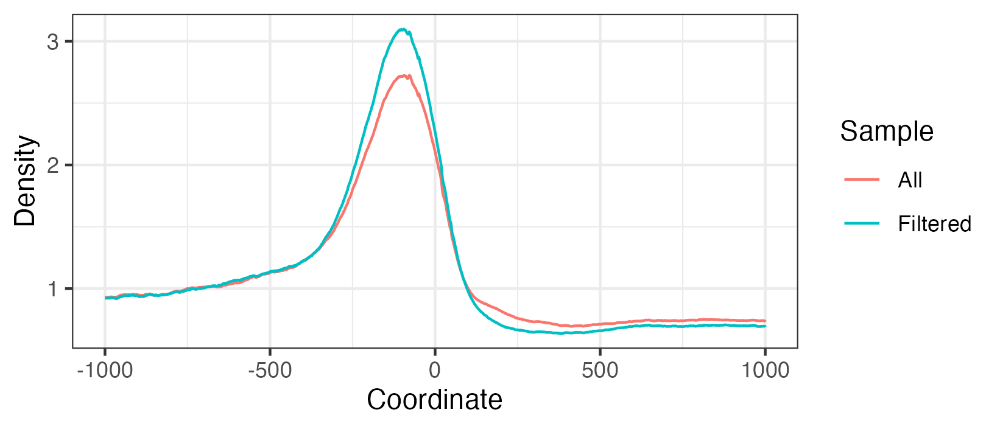

Evidently, only keeping the best reads can provide a decent boost to
the signal-to-noise ratio!

### Quick footprinting

Since Tn5 insertion sites can be defined at single base resolution
in ATAC-seq data, we can examine the insertion frequencies near
transcription factor binding sites for evidence of transcription
factor "footprints", which occur when the transcription factor
blocks the insertion activity of the transposase at its motif in
the genome. This type of analysis can already be accomplished
by a number of programs, which also take into account sequence
composition biases. While quaqc does not do such corrections, it
can nevertheless be used to quickly look for rough footprints
and compare them between target and background sites across the
genome.

As an example, we can see the insertion frequencies around the
TATA box -- which while not a transcription factor binding
site in the typical sense, does seem to affect transposition
frequency rather significantly in my experience, thus serving as a
good way to illustrate the type of result one might expect with this
kind of analysis:

```R
TATA_peaks <- system.file("extdata", "tata_p.bed.gz", package = "quaqcr")
TATA_bkg <- system.file("extdata", "tata_n.bed.gz", package = "quaqcr")

TATA.fp <- footprint(TATA_peaks, bam, bkg.motifs = TATA_bkg,
  target.names = "4")
#> quaqc --tss-qlen 1 --tss-size 501 --json - --target-names 4 --no-output --nfr --fast --tss-tn5 --tss /Users/ben/quaqcr/inst/extdata/tata_p.bed.gz SRR26098097.Chr4MtPt.bam
#> 
#> quaqc --tss-qlen 1 --tss-size 501 --json - --target-names 4 --no-output --nfr --fast --tss-tn5 --tss /Users/ben/quaqcr/inst/extdata/tata_n.bed.gz SRR26098097.Chr4MtPt.bam
ggplot(TATA.fp, aes(Distance, Frequency)) +
  scale_colour_discrete(name = element_blank()) +
  geom_line() +
  xlab("Distance from TATA box (bp)") +
  ylab("Relative insertion frequency") +
  facet_wrap(~Target) +
  theme_bw()
```
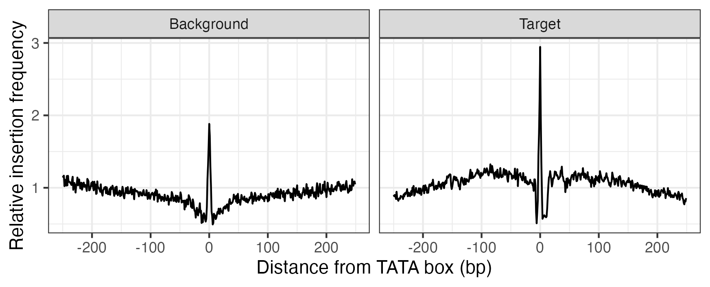

We can see in this plot how the TATA box itself seems to be quite
susceptible to transposition, but immediately downstream there
appears to be something instead blocking it, leaving a kind
of "footprint" which is deeper in accessible DNA compared to
inaccessible DNA. Curiously, the background TATA boxes seem
to also be quite susceptible to transposition; though without
correcting for Tn5 sequence bias, it is difficult to say what
could be happening with certainty.

### Fast read pileups around peaks

Finally, quaqc can be used to generate regular read pileups around
peaks of interest with the `pileup()` function. To show this, we
can test the function using the included peak file, using a higher
`qlen` parameter to smooth out the pileup:

```R
peak.pileup <- pileup(peaks, bam, qlen = 250, region.size = 10001,
  use.all = TRUE, target.names = "4")
#> quaqc --tss-qlen 250 --tss-size 10001 --json - --target-names 4 --no-output --fast --use-all --tss /Users/ben/quaqcr/inst/extdata/peaks.bed.gz SRR26098097.Chr4MtPt.bam
ggplot(peak.pileup, aes(Position, Signal)) +
  geom_line() +
  xlab("Distance from peak (bp)") +
  ylab("RPM") +
  theme_bw()
```
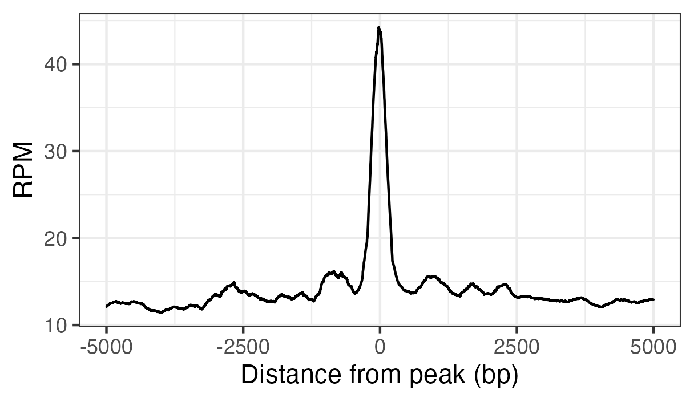

A few points to remember when using this function:

- quaqc only ever counts a read once during the pileup; as a
  result, overlapping ranges are removed since this would mean
  some ranges would only ever be partially covered by reads.
- The `qlen` parameter can be set to `0` to preserve the original
  read sizes.
- The 'signal' column can be normalized to reads per million (RPM),
  relative to the background, or simply the average number of reads
  per window.

There are no limits to the number of ranges that can be provided
to the `pileup()` function; it can even be used to plot a single
region in the genome in place of using a genome browser:

```R
peak1 <- system.file("extdata", "peak1.bed.gz", package = "quaqcr")
peak1.pileup <- pileup(peak1, bam, qlen = 0, region.size = 5001,
  use.all = TRUE, target.names = "4", tss.tn5 = TRUE)
#> quaqc --tss-qlen 0 --tss-size 5001 --json - --target-names 4 --no-output --fast --tss-tn5 --use-all --tss /Users/ben/quaqcr/inst/extdata/peak1.bed.gz SRR26098097.Chr4MtPt.bam
ggplot(peak1.pileup, aes(Position, Signal)) +
  geom_line() +
  ylab("RPM") +
  xlab("Chr4:5164654..5169654") +
  theme_bw()
```
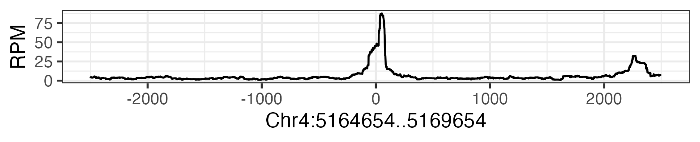

In this case we've simply plotted all reads in the BAM file as they
appear in this region. We can compare with filtering the reads and
resizing them from the point of insertion:

```R
peak1.filt <- pileup(peak1, bam, qlen = 100, region.size = 5001,
  strict = TRUE, target.names = "4", tss.tn5 = TRUE)
#> quaqc --tss-qlen 100 --tss-size 5001 --json - --target-names 4 --no-output --strict --fast --tss-tn5 --tss /Users/ben/quaqcr/inst/extdata/peak1.bed.gz SRR26098097.Chr4MtPt.bam
ggplot(peak1.filt, aes(Position, Signal)) +
  geom_line() +
  ylab("RPM") +
  xlab("Chr4:5164654..5169654") +
  theme_bw()
```
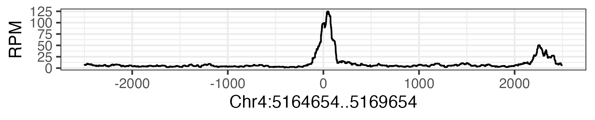

This concludes the overview of the functionality provided by
the `quaqcr` package. Feel free to open
an [issue](https://github.com/bjmt/quaqcr/issues) if you have
any questions!

